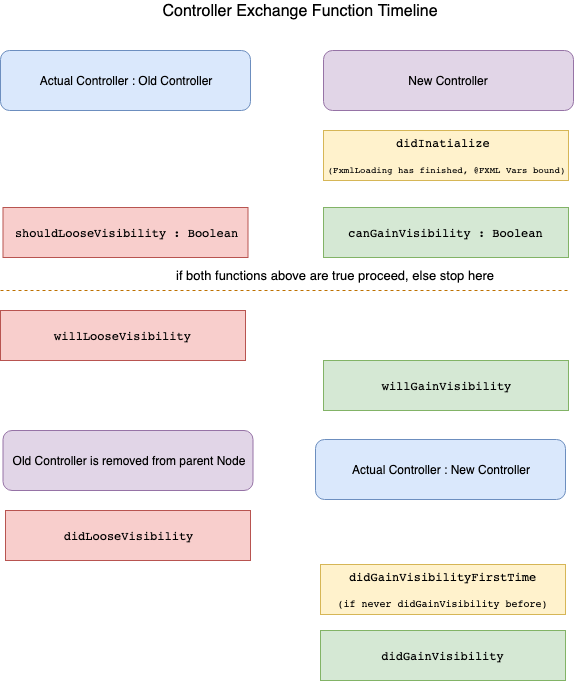

# ViewController

The ViewController is the core pattern for component based application design.

## Features

- Controller Lifecycle
- Node Locator
- Controller CDI Additions

## Controller Lifecycle

Main Part of the ViewController pattern is the exchange of the actual presented view.
Building a dynamic UI is all about build actual screen display from different
views (like Lego) and to exchange parts of the screen in case of navigation or other activities.

