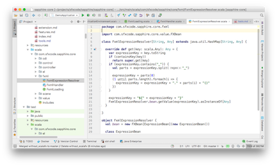
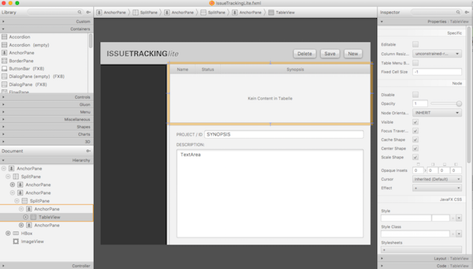

# Development Tools

Some useful tools.

## IntelliJ IDE

[IntelliJ](https://www.jetbrains.com/idea/download) is my favorite IDE for Scala / JavaFX Coding. Even the Community Edition has all features for developing JavaFX Applications.

## SceneBuilder

Scenebuilder (backed by Gluon) can be found at the [Gluon Site](http://gluonhq.com/products/scene-builder/).

## ScenicView

[Scenic View](http://fxexperience.com/scenic-view/) is a JavaFX application designed to make it simple to understand the current state of your application scenegraph, and to also easily manipulate properties of the scenegraph without having to keep editing your code. This lets you find bugs, and get things pixel perfect without having to do the compile-check-compile dance.

## SBT Plugins

### sbt-javafx

(Simple Build Tool) plugin for building JavaFx Application

[Documentation](https://quadstingray.github.io/sbt-javafx/)

 
 

