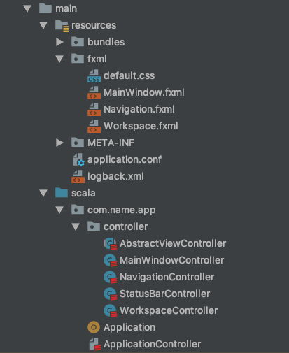

# Tutorial Setup

## Sources

The sources for this tutorial are in the [Github Tutorial Directory](https://github.com/sfxcode/sapphire-core/tree/master/demos/tutorial) of sapphire-core in the appdemo package.

## Setup

Easy Project Setup by usibg the sapphire-core giter8 template.
See giter8 Documentation for g8 setup.

[Giter8 template](http://www.foundweekends.org/giter8/) for [sapphire-core](https://sfxcode.github.io/sapphire-core).

### Usage

@@include[giter8.md](../includes/giter8.md)

### Base Project Structure

## IDE

[IntelliJ IDEA Community Edition](https://www.jetbrains.com/idea/download) or other IDE with Scala support.

## FXML Editor

Helpful for FXML Editing is the [Scene Builder](http://gluonhq.com/products/scene-builder/).

## Scene Graph Visualization

For understanding of the sccene graph there is a tool called [Scenic View
](http://fxexperience.com/scenic-view/).